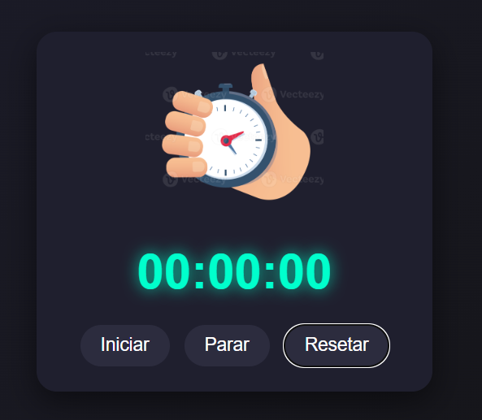
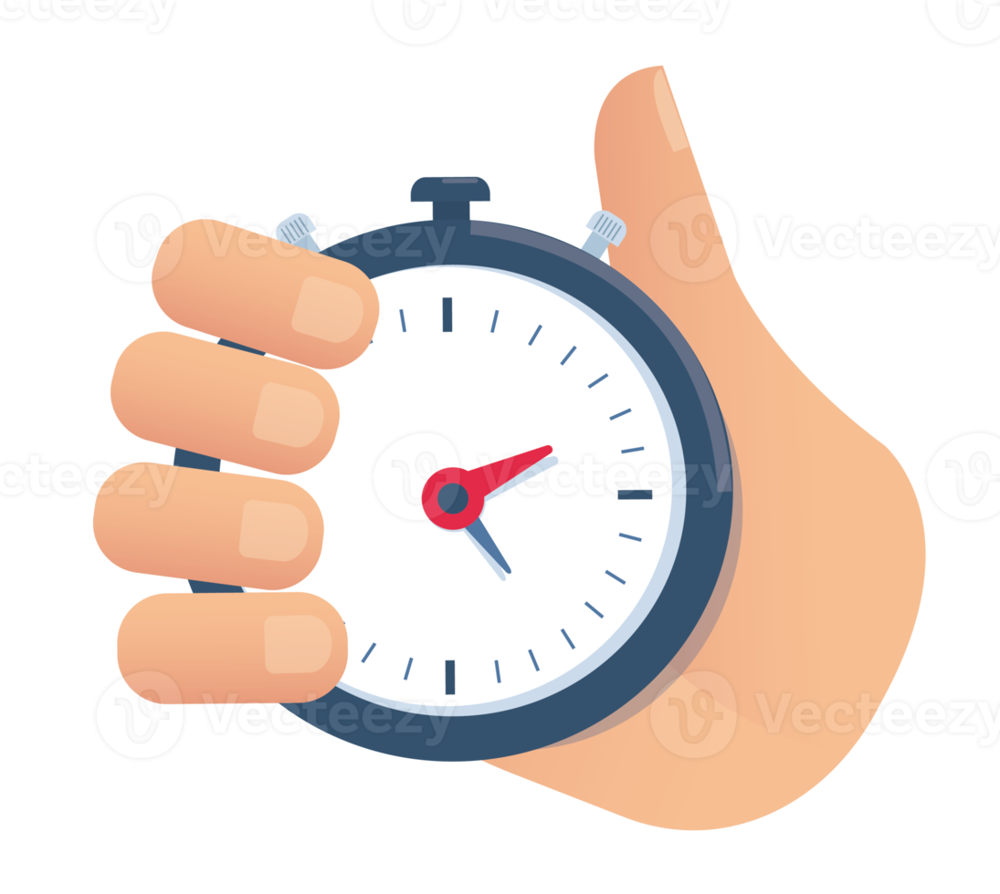

# ⏱️ Cronômetro JS

Um cronômetro simples e moderno desenvolvido com **HTML, CSS e JavaScript**, permitindo iniciar, pausar e resetar a contagem do tempo.

---

## 🚀 Funcionalidades

* ▶️ Iniciar contagem do tempo
* ⏸️ Pausar o cronômetro
* 🔄 Resetar para zero
* ⏱️ Exibição no formato `HH:MM:SS`
* 📱 Layout responsivo (mobile e desktop)

---

## 🖼️ Screenshot do projeto

<p align="center">
  
</p>

---

## 🖼️ Preview (logo do projeto)

<p align="center">
  
</p>

---

## 🛠️ Tecnologias utilizadas

* HTML5
* CSS3
* JavaScript (Vanilla JS)

---

## 📂 Estrutura do projeto

```
📁 projeto
 ├── index.html
 ├── style.css
 ├── script.js
 └── 📁 assets
      ├── cronometro.png
      └── screenshot.png
```

---

## 💡 Aprendizados

Durante o desenvolvimento deste projeto, foram praticados:

* Manipulação do DOM
* Uso de `setInterval` e `clearInterval`
* Lógica de contagem de tempo
* Formatação de dados (tempo)
* Responsividade com CSS

---

## 🔗 Acesse o projeto

👉 [Clique aqui para acessar](https://feramos1987.github.io/Cronometro/)

---

## 📌 Status do projeto

✅ Concluído

---

## 👨‍💻 Autor

Desenvolvido por Felipe Ramos🚀

